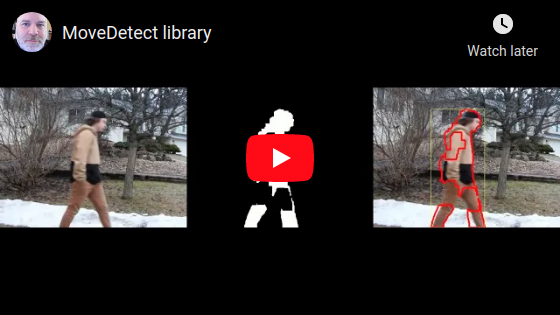

# What is MoveDetect?

MoveDetect is a C++ library that detects movement in video frames and returns a "true" or "false" value.

# License

MoveDetect is open source and published using the MIT license.  Meaning you can use it in your commercial application.  See license.txt for details.

# How to Build MoveDetect

MoveDetect requires OpenCV.  On Ubuntu:

	sudo apt-get install cmake build-essential libopencv-dev
	cd ~/src
	git clone https://github.com/stephanecharette/MoveDetect.git
	cd MoveDetect
	mkdir build
	cd build
	cmake -DCMAKE_BUILD_TYPE=Release ..
	make
	make package

# Example Code

MoveDetect has many configuration options to modify the detection threshold, mask output, and drawing bounding boxes and contour lines.

This is how to use it:

    // include MoveDetect.hpp and link against MoveDetect and OpenCV
    //
    MoveDetect::Handler handler;
    cv::VideoCapture video("movie.m4v");
    while (true)
    {
        cv::Mat frame;
        video >> frame;
        if (frame.empty())
        {
            break;
        }
        //
        const bool movement_detected = handler.detect(frame);
        if (movement_detected)
        {
            // ...
        }
    }

# C++ API Doxygen Output

The official MoveDetect documentation and web site is at <https://www.ccoderun.ca/programming/doxygen/movedetect/>.

Some links to specific useful pages:

- [`MoveDetect::Handler::detect()`](https://www.ccoderun.ca/programming/doxygen/movedetect/classMoveDetect_1_1Handler.html#a73d4d0c87f860a688bd1af02f40bd6e0)
- [`MoveDetect::Handler::mask`](https://www.ccoderun.ca/programming/doxygen/movedetect/classMoveDetect_1_1Handler.html#a6f999f42ec318f0ec6e94414a9aecc73)
- [`MoveDetect::Handler::output`](https://www.ccoderun.ca/programming/doxygen/movedetect/classMoveDetect_1_1Handler.html#aa581c0e65fd8bece68e15feaadeaea6c)
